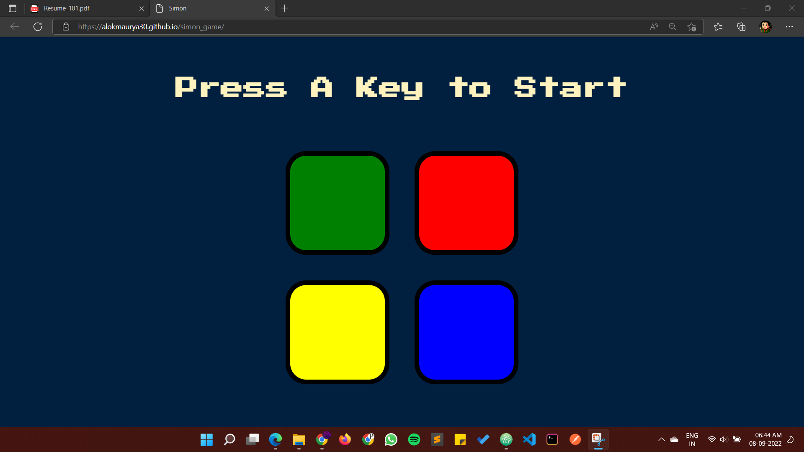
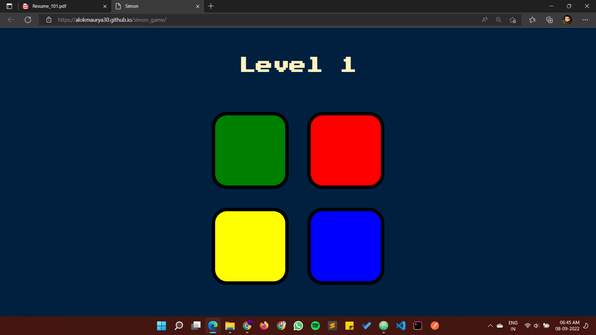
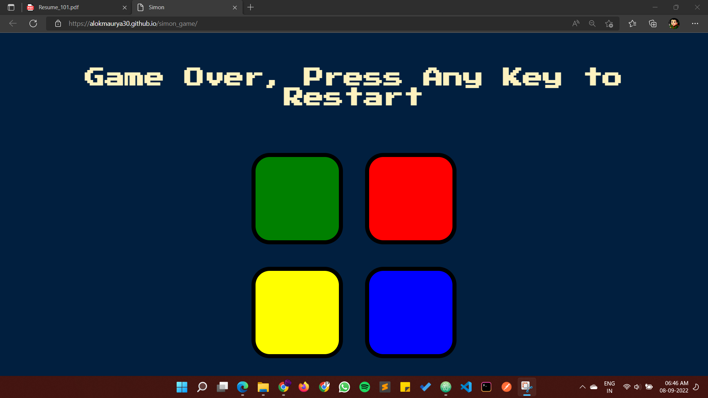

# simon_game
## A very popular game of the 1980’s. The device has four colored buttons, each producing a particular tone when it is pressed or activated by the device. A round in the game consists of the device lighting up one or more buttons in a random order, after which the player must reproduce that order by pressing the buttons. As the game progresses, the number of buttons to be pressed increases. If the user succeeds, the series becomes progressively longer and complex.
[Click here to see Website](https://alokmaurya30.github.io/simon_game/)

## Screenshots for Website.

## Before Starting of Game

## Moving up to levels

## Game is over

